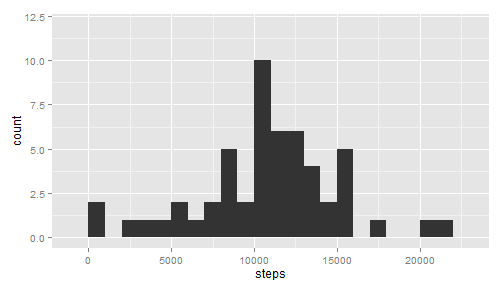
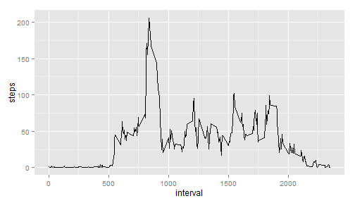
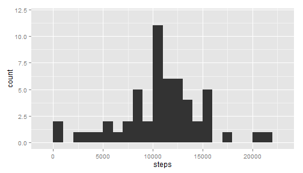
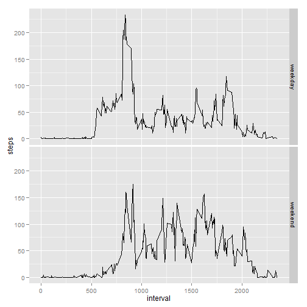

# Reproducible Research: Peer Assessment 1

## Basic settings
Load ggplot and set language to English.

```r
library(ggplot2)
Sys.setlocale("LC_TIME", "English")
```

## Loading and preprocessing the data
Unzip file and load into "data"

```r
unzip("activity.zip")
data <- read.csv("activity.csv", colClasses = c("integer", "Date", "integer"))
```

## What is mean total number of steps taken per day?
Make a histogram of the total number of steps taken each day

```r
step_by_day <- aggregate(steps ~ date, data = data, sum, na.rm = T)
qplot(step_by_day$steps, binwidth = 1000, ylim = c(0, 12))
```

 

Calculate and report the mean and median total number of steps taken per day.

```r
summary(step_by_day$steps)[c(3, 4)]
```

```
## Median   Mean 
##  10800  10800
```

## What is the average daily activity pattern?
Make a time series plot of the 5-minute interval (x-axis) and the average number of steps taken, averaged across all days (y-axis)

```r
step_by_interval <- aggregate(steps ~ interval, data = data, mean, na.rm = T)
qplot(interval, steps, data = step_by_interval, geom = "line")
```

 

Which 5-minute interval, on average across all the days in the dataset, contains the maximum number of steps?

```r
step_by_interval[step_by_interval$steps == max(step_by_interval$steps), 1]
```

```
## [1] 835
```

## Imputing missing values
Calculate and report the total number of missing values in the dataset.

```r
sum(is.na(data$steps))
```

```
## [1] 2304
```

Create a new dataset that is equal to the original dataset but with the missing data filled in with the mean of 5-minute interval for that day

```r
data1 <- data
data1$steps[is.na(data1$steps)] <- step_by_interval[step_by_interval$interval == 
    data1$interval[is.na(data1$steps)], 2]
```

Make a histogram of the total number of steps taken each day.

```r
step_by_day1 <- aggregate(steps ~ date, data = data1, sum)
qplot(step_by_day1$steps, binwidth = 1000, ylim = c(0, 12))
```

 

Calculate and report the mean and median total number of steps taken per day.

```r
summary(step_by_day1$steps)[c(3, 4)]
```

```
## Median   Mean 
##  10800  10800
```

## Are there differences in activity patterns between weekdays and weekends?
Create a new factor variable in the dataset with two levels – “weekday” and “weekend” indicating whether a given date is a weekday or weekend day

```r
data1$week <- sapply(data1$date, function(x) {
    a <- weekdays(x, T) %in% c("Sat", "Sun")
    if (a) {
        return("weekend")
    } else {
        return("weekday")
    }
})
```

Make a panel plot containing a time series plot of the 5-minute interval (x-axis) and the average number of steps taken, averaged across all weekday days or weekend days (y-axis).

```r
step_by_interval1 <- aggregate(steps ~ week + interval, data = data1, mean)
qplot(interval, steps, data = step_by_interval1, geom = "line", facets = week ~ 
    .)
```

 

